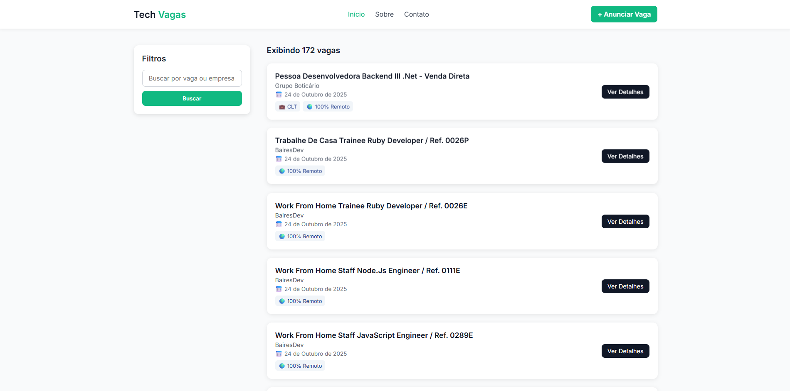

<h1 align="center">✅ Tech Vagas — Web Scraper de Vagas</h1>

<p align="center">
  Um agregador de oportunidades remotas que coleta vagas automaticamente com Puppeteer, armazena no MySQL e entrega uma interface web em EJS para consulta rápida. 🚀
</p>

---

### 📌 Tecnologias Utilizadas

#### 🖥️ Interface Web
<div>
  
  
  
  <span style="margin-left:8px;">EJS Templates</span>
</div>

#### 🛠️ Backend
<div>
  
  
  
  
</div>

---

### ✨ Funcionalidades

✔ Varre o Remotar.com.br em busca de vagas backend remotas utilizando Puppeteer  
✔ Persistência no MySQL com prevenção de duplicidades a cada nova coleta  
✔ API REST (`GET /vacancies` e `GET /vacancies/:id`) para integrações e consumo externo  
✔ Rotina agendada diariamente via `node-cron` para manter a base sempre atualizada  
✔ Interface em EJS com filtro por título ou empresa e visualização das tags de tecnologia  
✔ Layout responsivo com assets estáticos hospedados em Express

---

### 🖼️ Layout



> Substitua a imagem por uma captura de tela atual do projeto em `public/images/preview.png`.

---

## 🚀 Como executar o projeto na sua máquina

#### 🔹 Clonar o projeto

```bash
git clone https://github.com/miguelfelipe09/web-scraping.git
cd web-scraping
```

---

#### 📌 Pré-requisitos
- Node.js instalado ✅
- MySQL local ou remoto configurado ✅
- (Opcional) Google Chrome/Chromium disponível para o Puppeteer ✅

---

#### 🔹 Variáveis de ambiente
Crie um arquivo `.env` na raiz com as credenciais do banco:

```bash
mySqlUser=seu_usuario
mySqlPass=sua_senha
database=nome_do_banco
```

---

#### 🔹 Instalar dependências

```bash
npm install
```

---

#### 🔹 Executar o scraping manualmente (primeira carga opcional)

```bash
node src/scrape.js
```

---

#### 🔹 Iniciar o servidor web

```bash
node src/index.js
```

- A aplicação ficará disponível em `http://localhost:3000`.
- O cron executa o scraping automaticamente todos os dias à meia-noite.

---

👨‍💻 Autor

Miguel Felipe da Silva  
📎 LinkedIn: https://www.linkedin.com/in/miguel-felipe-aab18523a/
